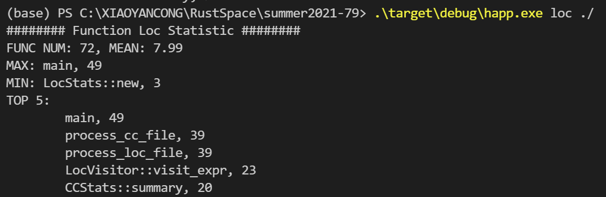
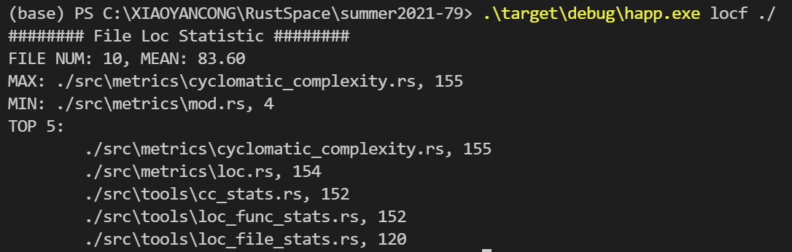

# 开发完善Rust社区中的度量工具项目中期报告

## 1. 项目信息

代码度量是一组软件度量指标，可让开发人员更好地了解他们正在开发的代码。通过代码度量工具，开发人员可以了解哪些类型或方法应该返工或更全面地测试。开发团队可以识别潜在风险，了解项目的当前状态，并在软件开发过程中跟踪进度。

在本项目中，需要根据项目要求完善Rust社区中的代码度量工具，部分可选内容如下：

- 代码重复率统计；
- 函数平均圈复杂度统计；
- 源文件重复率统计；
- 冗余代码行数统计；
- 文件平均代码行数统计；
- 函数平均代码行数统计；

要求输出代码满足内存安全、结构清晰、可扩展等标准；使用Rust语言开发并集成到cargo工具，用户可通过命令行获得结果

## 2. 进度安排

- 2021/07/01 – 2021/08/15 完成代码行数统计相关度量指标计算
- 2021/08/15 - 2021/09/30 完成圈复杂度计算并集成至cargo

## 3. 已完成工作

目前已完成内容如下：

- 圈复杂度计算：平均函数圈复杂度，最大圈复杂度，TOP5圈复杂度。
- 代码行数计算：函数平均代码行数，文件平均代码行数。

使用`syn`库解析Rust代码，得到AST。遍历AST计算圈复杂度。其中对`ItemFn`, `ImplItemMethod`, `ExprIf`, `ExprForLoop`, `ExprWhile`, `ExprMatch`, `GuardArm`, `BinOp::Or`和`BinOp::And` 判断增加圈复杂度。

使用`syn`项目下的`proc_macro2`库解析Rust代码，得到`TokenStream`。遍历`TokenStream`中的各个`Token`, 获取携带的代码行列位置信息，用于统计代码行数。

使用`clap`创建命令行应用，接收参数，解析路径，获取所有的Rust代码文件路径，并统计信息。

## 4. 使用截图

## 5. 现存问题

- `syn`对Rust注释的解析不太完善，貌似不支持`//`行注释的解析，这影响到注释行数的统计。
- 在统计逻辑代码行数时候，需要判断一下函数，方法宏或者方法调用是否是单独的一条`Stmt`还是嵌套的`Expr`，尚未找到判断方法。
- 当前代码质量未达到开源标准，有很多重复代码可以复用的，还有一些结构体方法设计不好。

## 6. 后续工作安排

- 提升代码质量
- 集成至cargo
- 在下述功能中再选几个实现：

  - 超大目录
  - 平均文件代码行
  - 超大头文件
  - 超大源文件
  - 文件重复率
  - 平均函数代码行
  - 超大函数
  - 总代码重复率
  - 原文件代码重复率
  - 平均圈复杂度
  - 超大圈复杂度
  - 冗余代码
  - 危险函数`
